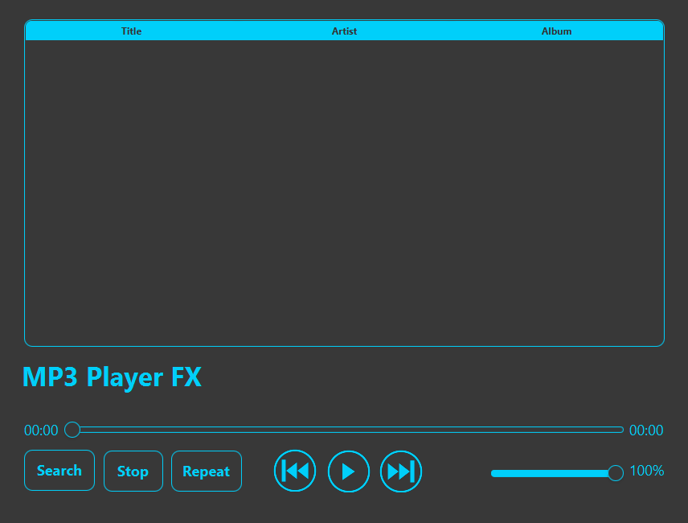

# Mp3 Player JavaFX

Made with JavaFX 17.0.1 and OpenJDK 17.0.1.
Used IntelliJ IDEA.
Inspired by the [video](https://www.youtube.com/watch?v=-D2OIekCKes) that Bro Code made.

## Features
- Create a Playlist.
- Sort music with drag and drop.
- Use Arrows to control volume and move through the song.
- Use Spacebar to play/pause the song.
- Simple and elegant GUI.

## Screenshot

